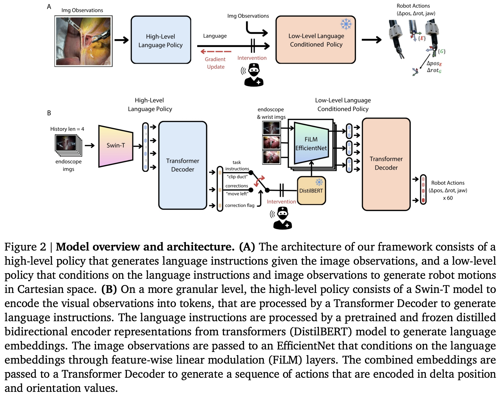

</img>

## SRT-H (wip)

Implementation of the model architecture for [SRT-H](https://h-surgical-robot-transformer.github.io/) out of Johns Hopkins

## Citations

```bibtex
@misc{kim2025srthhierarchicalframeworkautonomous,
    title   = {SRT-H: A Hierarchical Framework for Autonomous Surgery via Language Conditioned Imitation Learning}, 
    author  = {Ji Woong Kim and Juo-Tung Chen and Pascal Hansen and Lucy X. Shi and Antony Goldenberg and Samuel Schmidgall and Paul Maria Scheikl and Anton Deguet and Brandon M. White and De Ru Tsai and Richard Cha and Jeffrey Jopling and Chelsea Finn and Axel Krieger},
    year    = {2025},
    eprint  = {2505.10251},
    archivePrefix = {arXiv},
    primaryClass = {cs.RO},
    url     = {https://arxiv.org/abs/2505.10251}, 
}
```

```bibtex
@article{Kim2024SurgicalRT,
    title   = {Surgical Robot Transformer (SRT): Imitation Learning for Surgical Tasks},
    author  = {Ji Woong Kim and Tony Zhao and Samuel Schmidgall and Anton Deguet and Marin Kobilarov and Chelsea Finn and Axel Krieger},
    journal = {ArXiv},
    year    = {2024},
    volume  = {abs/2407.12998},
    url     = {https://api.semanticscholar.org/CorpusID:271270134}
}
```
